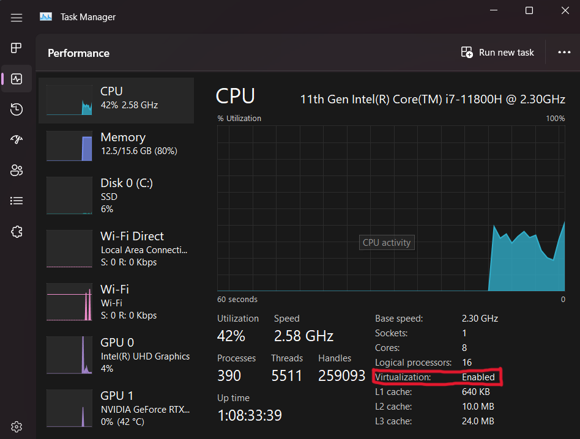

# WSL Setup

For your training you will need a few tools. Namely:

- Windows Terminal
- Windows Subsystem for Linux
- Installing Ubuntu
- Git
- C compiler toolchain (GCC)
- A text editor (VSCode)

This section will cover how to install WSL on Windows. If you already have a WSL setup you can skip these steps.

## Installing Windows Terminal

The first thing you will need is the new Windows Terminal app. This makes it easier to have multiple shells open, even different shells. This will be used to access your WSL instance.

[Windows Terminal Download](https://apps.microsoft.com/store/detail/windows-terminal/9N0DX20HK701)

> Note:
>
> Shells are an environments that allow access to the operating system (OS), hardware and other system processes through simple shell commands, usually a shell language like Bash or Powershell.

## Installing and Setting Up WSL

Before you begin make sure to update Windows to make sure you have the latest version. You will then need to check in order to see if you can install WSL is if virtualization is enabled for your device. You can check this by opening 'Task Manager', clicking on the performance tab and looking at the CPU details. There will be an option called 'Virtualization' which should say 'Enabled'.



Next, open Powershell with Administrative Privileges and run the following command.

```ps
wsl --install -d Ubuntu-22.04
```

Once this has finished, you may need to restart your machine. With that WSL is installed. You should be able to open a Ubuntu shell using Windows Terminal by clicking the arrow icon next to the default tab and selecting Ubuntu. On your first launch, this may require you to setup your user credentials.

## Installing Packages

To begin, you will need to install some packages. This will be done using `apt`, Ubuntu's system package manager. Run the commands in the shell.

```sh
# `sudo` represents 'super user do'.
 
# This runs a command with admin. privileges.
# Update apt's local package index.
sudo apt update

# The `-y` flag means upgrade yes to all.
# This bypasses confirming package upgrades.
# Upgrade packages with new versions
sudo apt upgrade -y

# Installs specified packages (separated by spaces).
sudo apt install git curl wget ca-certificates build-essential
```

And that's it. WSL is setup and installed.

## VSCode Installation and Setup

Now that WSL is installed and setup we will want to setup a text editor so we can easily edit and build our programs. For usage with WSL ans your training in general I recommend using VSCode as it allows you to customize you developer environment to your needs. It also can access the WSL filesystem allowing you to work on projects in a native Linux environment on Windows. If you prefer another editor such as Vim, Emacs or Neovim, feel free to use them as you please.

First download VSCode for Windows [VSCode Download](https://code.visualstudio.com/download)

Once installed, open (on the Windows side) and navigate to the extensions tab (icon on the left size made of four boxes). Using the search bar, install the following extensions.

- C/C++
- GitLens
- Git Graph
- GitHub Pull Requests and Issues
- Sonarlint
- Remote development
- WSL
- Remote SSH

You can then navigate to the window with the Ubuntu shell from before and run:

```sh
code .
```

This will installed VSCode on the WSL from your Windows version and open it in the home directory. And thats it, you are done.
