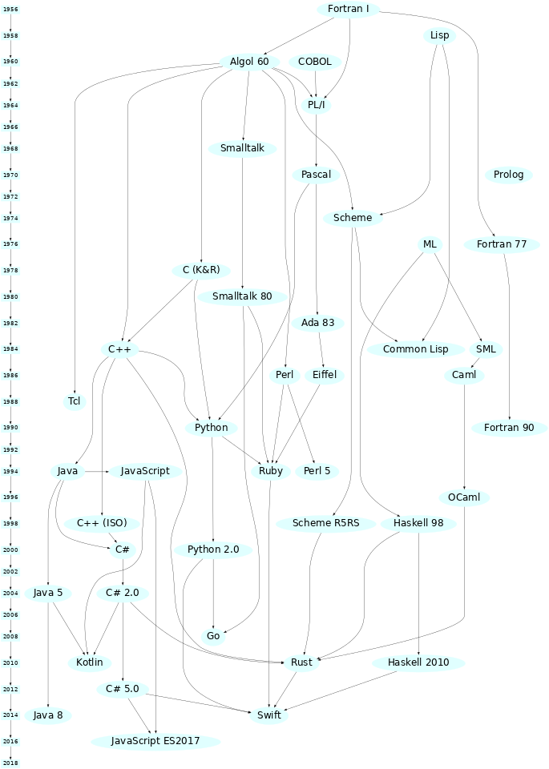

# Brief Introduction to C

## What is C?

What is C? You may have heard of a something called C in your classes or online but may be unaware of what it is and what it is used for. Simply put C is a general purpose programming language developed at Bell Labs in 1972 by Dennis Ritchie. It was designed to closely reflect the architecture and capabilities of the target device. It was popularized in large part due to its usage and role in the UNIX operating system. Before languages like C, developers and engineers had to mostly use assembly languages; the instruction code that was specific to every single device (CPU in particular), meaning an application for one device would have to be rewritten in the new devices assembly language. C aimed to make this easier, creating a unified language that could then be compiled to any target architecture. The 'write once, compile everywhere' philosophy. This dramatically increased the capabilities of developers to create portable applications that were also easier to write.

## Design

C is a very simple programming language. It has relatively minimal syntax, a small standard library and only a few primitive data types and entities. C's power comes from its simplicity, it allows developers to utilise any and all components of a computer in any way the developer sees fit. This is because C is still able to target various system-level operations such as allocate memory and make system calls. This capability is derive from C originating as the language that was used to create the UNIX operating system, the predecessor of Linux and MacOS. C and UNIX were  developed simultaneously meaning any operation they needed UNIX to perform had to be accessible from C. C also has a very simple memory model that closely reflects how computer memory is designed today which follows Alan Turing's original description of a Turing machine ie. memory is an infinitely (not truly infinite, but for arguments sake) long tape of individually addressable cells.

## Technical Description

C is a static and weakly typed language. What are types? Types are in essence a form of structure, typically dictated by their layout ie. their size in memory. Every language has type system which dictates the operations that can be performed on a particular types and the semantics for when these operations can occur. A statically typed language means that the compiler must know the type of every piece of data in a program. This is because data has a fixed width in C meaning any program written in C must have a known size such that the it can actually run on a machine. Weakly typed describes a language for which data types are allowed to have implicit conversions. This means that you can utilise the same data but in a different shape. This is sometimes useful but more often is a pitfall to the language.

## Family History

While many people will talk about the C family of languages, many of the execution techniques used in C were inspired by another language called ALGOL developed in the late 50's. Many of the principles in ALGOL were using in C. See is also the successor to the B programming language (also developed at Bell Labs by Ken Thompson and Dennis Ritchie). C has inspired almost every procedural language used today and has had a massive influence on other language families. Some of the descendants of the C language include C++, Swift, JavaScript, PHP, Rust, HolyC, Java, Go, C#, Perl and (depending who you ask) Python.

### Entire (mostly) Programming Language Lineage

### Simplified Programming Language Lineage

