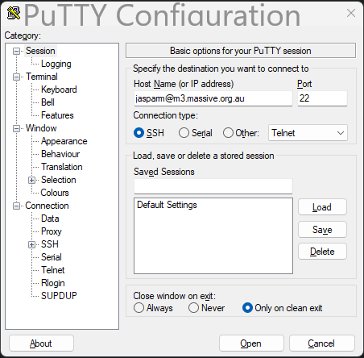
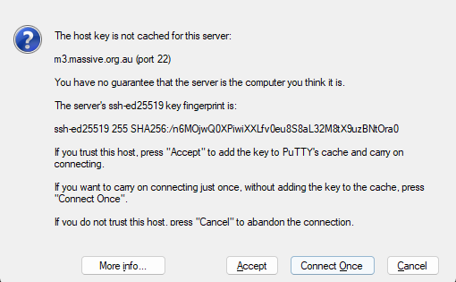

# Logging In

First you will need to ssh into a login node in the cluster. You do this by doing the following:

## Windows

If you are using windows, the best way to ssh into m3 is by using [puTTY](https://www.chiark.greenend.org.uk/~sgtatham/putty/latest.html).

Once installed and opened, you will see a page like this:



Type in your m3 username followed by `@m3.massive.org.au` and press enter or the Open button.

If it the first time accessing M3 from this client then you may see something like this:



Just click Accept, and puTTY will add the cluster's ssh fingerprint to cache.

## Mac / Linux

On macOS or linux, ssh is built into the terminal, so just copy the following into your shell, substituting username for your username.

```bash
ssh username@m3.massive.org.au
```

You may get a similar warning to the above image about the server identity, just type `yes` or `Y` to accept it and add the ssh key to cache.

Everything from now on will be the same across whatever computer you are using to access the cluster.

The first thing to pop up will be a request for a password. Don't worry when you don't see your cursor moving when typing, this is just for security. Your password is still being recorded.

Once you have logged in, you will come to a page that looks like this:

```txt
+----------------------------------------------------------------------------+
|                            Welcome to MASSIVE M3                           |
|                                                                            |
|    For assistance please contact help@massive.org.au or (03) 9902 4845     |
|     The MASSIVE User Guide          https://docs.massive.org.au            |
+----------------------------------------------------------------------------+

  - Useful Slurm Commands:
     squeue
     sbatch <slurm_script_file>
     scontrol show job <JOBID>
     scancel <JOBID>

  - Massive User Scripts:
     show_job
     show_job <JOBID>
     show_cluster
     user_info

  - Slurm Sample Scripts are Here:
     /usr/local/hpcusr/latest/training/samples/slurm/

  - We recommend using smux to compile and test code on compute nodes.
  - How to use smux: https://docs.massive.org.au/M3/slurm/interactive-jobs.html

 For more details, please see:
    https://docs.massive.org.au/M3/slurm/slurm-overview.html
------------------------------------------------------------------------------

Use MASSIVE Helpdesk to request assistance with MASSIVE related computing
questions and problems. Email to help@massive.org.au and this will generate
a ticket for your issue.

------------------------------------------------------------------------------


[jasparm@m3-login2 ~]$
```

Once you are done and want to logout, just type `exit`. This will close the connection.
