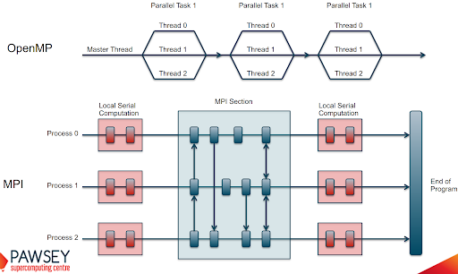

# What is Distributed Computing

**Distributed computing is parallel execution on distributed memory architecture.**

This essentially means it is a form of parallel computing, where the processing power is spread across multiple machines in a network rather than being contained within a single system. In this memory architecture, the problems are broken down into smaller parts, and each machine is assigned to work on a specific part.

## Distributed Memory Architecture

Lets have a look at the distributed memory architecture in more details.

- Each processor has its own local memory, with its own address space
- Data is shared via a communications network using a network protocol, e.g Transmission Control Protocol (TCP), Infiniband etc..

## Distributed vs Shared program execution

The following diagram provides another way of looking at the differences between distributed and shared memory architecture and their program execution.

## Advantages of distributed computing

There are number of benefits to distributed computing in particular it addresses some shortcomings of shared memory architecture.

- No contention for shared memory since each machine has its own memory. Compare this to shared memory architecture where all the cpu's are sharing the same memory.
- Highly scalable as we can add more machines and are not limited by RAM.
- Effectively resulting in being able to handle large-scale problems

The benefits above do not come without some drawbacks including network overhead.

## Disadvantages of distributed computing

- Network overload. Network can be overloaded by:
  - Multiple small messages
  - Very large data throughput
  - Multiple all-to-all messages (N^2 growth of messages)
- Synchronization failures
  - Deadlock (processes waiting for an input from another process that never comes)
  - Livelock (even worse as it’s harder to detect. All processes shuffling data around but not progressing in the algorithm )
- More complex software architecture design.
  - Can also be combined with threading-technologies as openMP/pthreads for optimal performance.
